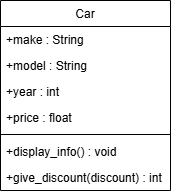

# Car Class UML
## Overview
#### This code defines a Car class, representing a car with attributes such as make, model, year, and price. The class includes methods for displaying car info and applaying discount

## UML Class Diagram

## Class Definition
### The Car class includes:

- A constructor to initialize car details (make, model, year, price)
- A display_info method to print car details
- An apply_discount method to adjust the car price
